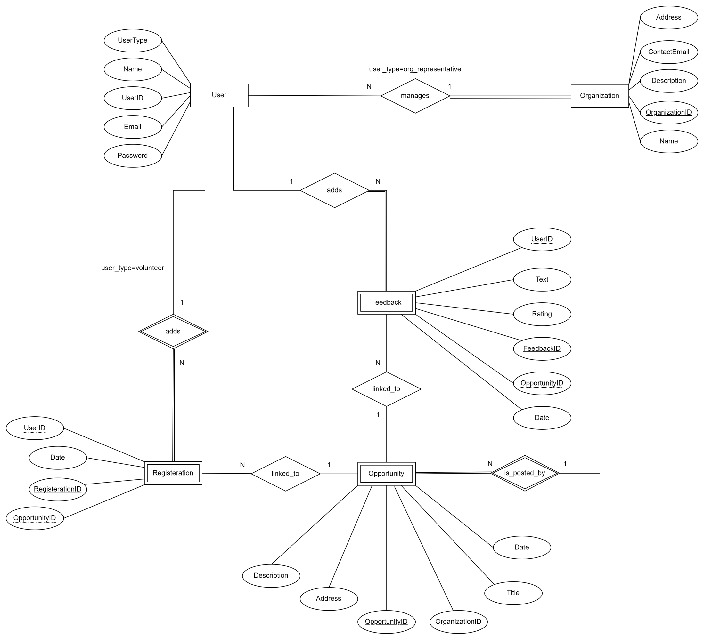

### Purpose

VolunteerConnect is a platform designed to link volunteers with organizations and events that need their support. It serves as a central hub where volunteers can discover opportunities, sign up for events and provide feedback. Similarly, organizations can post volunteer opportunities.

The system aims to facilitate the management of volunteer efforts, ensuring that volunteers can easily find causes to support while organizations can efficiently manage their volunteer workforce.

### Pages

**Volunteers:**

* Home (Public): The starting point for volunteers, showcasing upcoming events and personalized recommendations.
* Opportunity Listing (Public): A list of available volunteering opportunities for users to browse.
* Opportunity Details (Public): Detailed view of a selected opportunity with event-specific information.
* Profile: A volunteer’s personal page for managing their details and viewing history.

**Organizations:**

* Listing  (Public)
* Create Opportunity: Create a new opportunity.
* Organization Profile (Public): Showcasing organization's mission and events

**Common:**

* Login/Registration: Entry point for users to log in or create a new account.

### Entity-Relationship (ER) Diagram

## Teaser (MS3)

